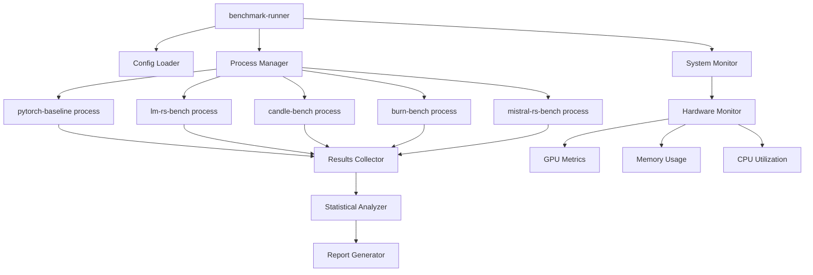

# Benchmark Runner

## Overview

**Central orchestration system** that spawns isolated inference engine processes, collects performance data, and generates comprehensive comparison reports. This is the primary entry point for running complete benchmark suites.

## What This Does

### Process Orchestration
- **Isolated Execution**: Spawns each engine as independent process
- **Fair Comparison**: Ensures no shared state between engines
- **Resource Monitoring**: Tracks GPU, CPU, and memory usage
- **Error Handling**: Graceful handling of engine failures
- **Results Aggregation**: Collects and normalizes performance data

### Statistical Analysis
- **Performance Metrics**: Calculates mean, median, percentiles, standard deviation
- **Significance Testing**: Statistical validation of performance differences
- **Outlier Detection**: Identifies and handles anomalous measurements
- **Confidence Intervals**: Provides uncertainty bounds for results

### Report Generation
- **Comparison Tables**: Side-by-side performance comparisons
- **Visualization**: Charts showing performance across engines
- **Business Metrics**: Cost analysis and deployment recommendations
- **Raw Data Export**: Complete datasets for further analysis

## Architecture



## Key Features

### Fair Benchmarking
```rust
pub struct BenchmarkRunner {
    engine_configs: HashMap<String, EngineConfig>,
    system_monitor: SystemMonitor,
    results_analyzer: StatisticalAnalyzer,
}

impl BenchmarkRunner {
    pub async fn run_comparative_benchmark(&self, config: &BenchmarkConfig) -> Result<ComparisonReport> {
        let mut all_results = HashMap::new();
        
        for engine_name in &config.engines {
            // Clean system state between engines
            self.system_monitor.reset_metrics();
            
            // Spawn isolated process
            let results = self.run_isolated_engine(engine_name, &config.workload).await?;
            all_results.insert(engine_name.clone(), results);
            
            // Cool-down period to prevent thermal effects
            tokio::time::sleep(Duration::from_secs(5)).await;
        }
        
        Ok(self.results_analyzer.generate_comparison(all_results))
    }
}
```

### System Monitoring
- **GPU Metrics**: Utilization, memory usage, temperature, power draw
- **CPU Metrics**: Usage per core, frequency scaling, thermal state
- **Memory Tracking**: RAM and VRAM consumption patterns
- **Performance Counters**: Hardware-level performance monitoring

### Statistical Rigor
- **Sample Size Validation**: Ensures adequate statistical power
- **Normality Testing**: Validates statistical assumptions
- **Multiple Comparisons**: Bonferroni correction for multiple engines
- **Effect Size Calculation**: Practical significance beyond statistical significance

## Configuration

### Benchmark Configuration
```yaml
benchmark:
  name: "Comprehensive LLM Inference Comparison"
  output_dir: "./results/comprehensive"
  model_path: "./models/llama-3.2-1b-instruct"

engines:
  - name: "pytorch_baseline"
    enabled: true
    binary_path: "./target/release/pytorch-baseline"
    
  - name: "lm_rs"
    enabled: true  
    binary_path: "./target/release/lm-rs-bench"
    
  - name: "candle_cuda"
    enabled: true
    binary_path: "./target/release/candle-bench"
    
  - name: "burn_cuda"
    enabled: true
    binary_path: "./target/release/burn-bench"
    
  - name: "mistral_rs"
    enabled: true
    binary_path: "./target/release/mistral-rs-bench"

workloads:
  - name: "latency_test"
    description: "Single request latency measurement"
    test_cases:
      - prompt: "Hello, how are you?"
        max_tokens: 50
        temperature: 0.7
    iterations: 100
    warmup_iterations: 10
    
  - name: "throughput_test"
    description: "Sustained throughput measurement"
    test_cases:
      - prompt: "Write a short story about AI"
        max_tokens: 200
        temperature: 0.7
    iterations: 50
    warmup_iterations: 5

analysis:
  confidence_level: 0.95
  remove_outliers: true
  outlier_threshold: 2.0  # standard deviations
  significance_test: "mann_whitney_u"
  generate_plots: true
  export_raw_data: true
```

### System Configuration
```yaml
system:
  gpu_device: 0
  max_memory_gb: 20
  cpu_affinity: [0, 1, 2, 3]  # Pin to specific cores
  thermal_limit_celsius: 80
  cool_down_seconds: 5
  
monitoring:
  sample_interval_ms: 100
  gpu_metrics: true
  memory_tracking: true
  power_monitoring: true
```

## Usage

### Quick Benchmark
```bash
# Build all engines
cargo build --release

# Run basic comparison
cargo run --bin benchmark-runner -- \
  --config configs/quick-test.yaml \
  --output ./results/quick

# Results in ./results/quick/
```

### Comprehensive Analysis
```bash
# Full benchmark suite (30-60 minutes)
cargo run --release --bin benchmark-runner -- \
  --config configs/comprehensive.yaml \
  --output ./results/comprehensive \
  --verbose

# Generate additional analysis
cargo run --bin benchmark-runner -- \
  --analyze-only \
  --results ./results/comprehensive \
  --generate-report
```

### Engine-Specific Testing
```bash
# Test specific engines only
cargo run --bin benchmark-runner -- \
  --config configs/gpu-only.yaml \
  --engines "candle_cuda,burn_cuda,mistral_rs" \
  --output ./results/gpu-comparison
```

## Output Structure

### Results Directory
```
results/comprehensive/
├── summary.json              # Machine-readable results
├── report.html              # Interactive dashboard
├── comparison_table.md       # Markdown comparison
├── raw_data/
│   ├── pytorch_baseline.json # Individual engine results
│   ├── candle_cuda.json
│   ├── burn_cuda.json
│   └── ...
├── analysis/
│   ├── statistical_summary.json
│   ├── performance_analysis.json
│   └── business_recommendations.json
├── plots/
│   ├── latency_comparison.png
│   ├── throughput_scaling.png
│   ├── memory_usage.png
│   └── gpu_utilization.png
└── logs/
    ├── benchmark.log         # Execution log
    └── system_metrics.log    # Hardware monitoring
```

### Summary Report Example
```json
{
  "summary": {
    "fastest_engine": "burn_cuda",
    "best_throughput": 387.5,
    "best_latency_ms": 28.3,
    "most_consistent": "mistral_rs",
    "best_gpu_utilization": "burn_cuda",
    "recommendation": "burn_cuda for throughput, mistral_rs for consistency"
  },
  "comparison_matrix": {
    "pytorch_baseline": {"latency_ms": 298.7, "throughput": 41.2, "speedup": 1.0},
    "lm_rs": {"latency_ms": 95.3, "throughput": 89.4, "speedup": 3.1},
    "candle_cuda": {"latency_ms": 52.1, "throughput": 198.6, "speedup": 5.7},
    "burn_cuda": {"latency_ms": 28.3, "throughput": 387.5, "speedup": 10.6},
    "mistral_rs": {"latency_ms": 41.7, "throughput": 267.3, "speedup": 7.2}
  }
}
```

## Business Intelligence

### Cost Analysis
- **Hardware Requirements**: GPU memory, compute requirements per engine
- **Infrastructure Costs**: Cloud GPU costs for different performance levels
- **Development Effort**: Implementation complexity for each engine
- **Operational Overhead**: Deployment and maintenance considerations

### Deployment Recommendations
- **Performance Tiers**: Matching engines to performance requirements
- **Cost Optimization**: Performance per dollar analysis
- **Risk Assessment**: Maturity and stability evaluation
- **Migration Paths**: Transition strategies from current infrastructure

## Success Metrics

### Statistical Validation
- **Adequate Sample Size**: >50 measurements per test case
- **Statistical Significance**: p-value < 0.05 for performance differences
- **Confidence Intervals**: 95% confidence bounds for all measurements
- **Effect Size**: Practical significance assessment

### Reproducibility
- **Variance Control**: <10% coefficient of variation within engines
- **Environmental Isolation**: Consistent hardware state between tests
- **Version Locking**: Exact dependency versions recorded
- **Documentation**: Complete reproduction instructions

This benchmark runner provides the foundation for rigorous, reproducible, and business-relevant inference engine comparisons.