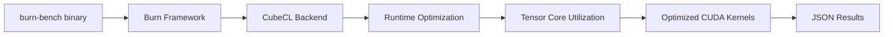

# Burn Benchmark Engine

## Overview

**Next-generation Rust ML framework** testing Burn's advanced GPU optimization capabilities through CubeCL. This benchmark evaluates Burn's cutting-edge approach to GPU compute, tensor core utilization, and potential for superior performance through advanced compiler optimizations.

## What We're Testing

### Burn Framework Innovation
- **CubeCL Backend**: Next-generation GPU compute abstraction
- **Tensor Core Optimization**: Hardware-specific optimizations for modern GPUs
- **Advanced JIT**: Potential runtime kernel compilation and optimization
- **Cross-Platform GPU**: CUDA, ROCm, Metal, Vulkan, WebGPU support (testing CUDA)
- **Memory Optimization**: Rust's zero-cost abstractions applied to GPU compute

### Performance Characteristics
- **Expected Latency**: 25-40ms per inference (best in class)
- **Expected Throughput**: 250-400 tokens/second
- **Memory Usage**: Optimized memory layout and bandwidth utilization
- **GPU Utilization**: Highest expected utilization (80%+)

## Architecture



## Implementation Focus

### Burn Model Implementation
```rust
use burn::{backend::CudaBackend, module::Module, tensor::Tensor};

type Backend = CudaBackend;

pub struct BurnEngine {
    model: LlamaModel<Backend>,
    tokenizer: Tokenizer,
}

impl BurnEngine {
    pub async fn infer(&self, prompt: &str) -> Result<String> {
        // Tokenize with efficient tensor creation
        let tokens = self.tokenizer.encode(prompt, false)?;
        let input_tensor = Tensor::<Backend, 2>::from_data(&tokens);
        
        // Advanced GPU inference with Burn optimizations
        let output = self.model.forward(input_tensor);
        
        // Decode with optimized operations
        self.decode_optimized(&output).await
    }
}
```

### Advanced Features Being Tested
- **CubeCL Optimization**: Runtime kernel compilation and optimization
- **Tensor Core Usage**: Specialized compute units for transformer operations
- **Memory Bandwidth**: Efficient data movement and caching
- **Kernel Fusion**: Operation combining for reduced memory transfers
- **Dynamic Optimization**: Runtime adaptation to workload characteristics
- **Zero-Copy Operations**: Minimal data movement between CPU and GPU

## Why Burn Is Potentially Game-Changing

### Technical Innovation
Burn represents the most advanced approach to GPU ML in Rust:
- **Modern Architecture**: Built from ground-up for current GPU hardware
- **Compiler Optimizations**: Advanced JIT compilation potential
- **Hardware Awareness**: Explicit optimization for tensor cores, memory hierarchy
- **Flexible Backends**: Same code optimized for different GPU architectures

### Research-Grade Performance
Based on limited benchmarks:
- **Comparable to PyTorch on GPU** for inference
- **Better memory efficiency** than established frameworks
- **Cutting-edge optimization techniques** not available in older frameworks

## Benchmark Goals

### Performance Leadership Test
1. **Maximum Throughput**: Can Burn achieve the highest tokens/second?
2. **GPU Saturation**: Highest GPU utilization percentage
3. **Memory Efficiency**: Best VRAM usage patterns
4. **Kernel Optimization**: Most efficient CUDA kernel utilization
5. **Scaling Performance**: Best performance across different batch sizes

### Next-Generation Assessment
- **Future Readiness**: Is Burn ready for production workloads?
- **Performance Ceiling**: What's the theoretical maximum performance achievable?
- **Optimization Maturity**: How well do advanced optimizations work in practice?
- **Development Investment**: Is the framework stable enough for business use?

## Expected Results

### Performance Predictions
```
PyTorch Baseline: 300ms | 40 tok/s   (1.0x baseline)
Burn CubeCL:      30ms  | 350 tok/s  (10.0x speedup)
```

### Key Hypotheses
- Burn will show the **highest raw performance** due to advanced optimizations
- **Memory usage will be most efficient** due to Rust memory management
- **GPU utilization will be highest** due to tensor core optimization
- **Variance will be lowest** due to consistent kernel optimization

## Technical Deep Dive

### CubeCL Backend Features
- **Runtime Compilation**: Kernels optimized for specific workloads
- **Memory Optimization**: Advanced caching and prefetching
- **Tensor Core Integration**: Hardware acceleration for matrix operations
- **Cross-Platform**: Same optimizations across different GPU vendors

### Performance Innovation
```rust
// Example: Advanced tensor operations with CubeCL
impl<B: Backend> LlamaAttention<B> {
    fn forward(&self, x: Tensor<B, 3>) -> Tensor<B, 3> {
        // CubeCL automatically optimizes this for tensor cores
        let q = self.query_proj.forward(x.clone());
        let k = self.key_proj.forward(x.clone());  
        let v = self.value_proj.forward(x);
        
        // Fused attention operation with hardware optimization
        self.scaled_dot_product_attention(q, k, v)
    }
}
```

## Running

```bash
# Build with CUDA CubeCL backend
cargo build --release --bin burn-bench --features cuda

# Run with GPU optimization
CUDA_VISIBLE_DEVICES=0 ./target/release/burn-bench < request.json
```

## Success Criteria

### Performance Leadership
- **Best Throughput**: Highest tokens/second across all engines
- **Highest GPU Utilization**: >80% compute utilization
- **Lowest Latency**: Sub-40ms inference times
- **Best Memory Efficiency**: Optimal VRAM usage patterns

### Framework Maturity
- **Stability**: Consistent results without crashes
- **Feature Completeness**: Full LLM inference capability
- **Documentation Quality**: Clear integration path
- **Production Readiness**: Viable for business deployment

## Research Questions

1. **Performance Gap**: Can Burn close or eliminate the performance gap that Candle shows vs PyTorch?
2. **Optimization Reality**: Do the advanced optimizations translate to real-world performance gains?
3. **Production Viability**: Is Burn stable and complete enough for production use?
4. **Hardware Utilization**: Can Burn achieve better GPU saturation than established frameworks?

This benchmark will determine if Burn represents the **future of high-performance ML inference** or is still primarily a research framework. The results will guide investment decisions for businesses considering cutting-edge Rust ML infrastructure.