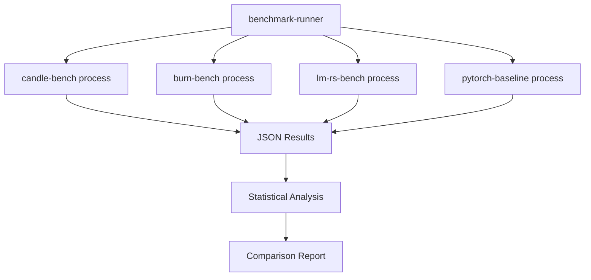
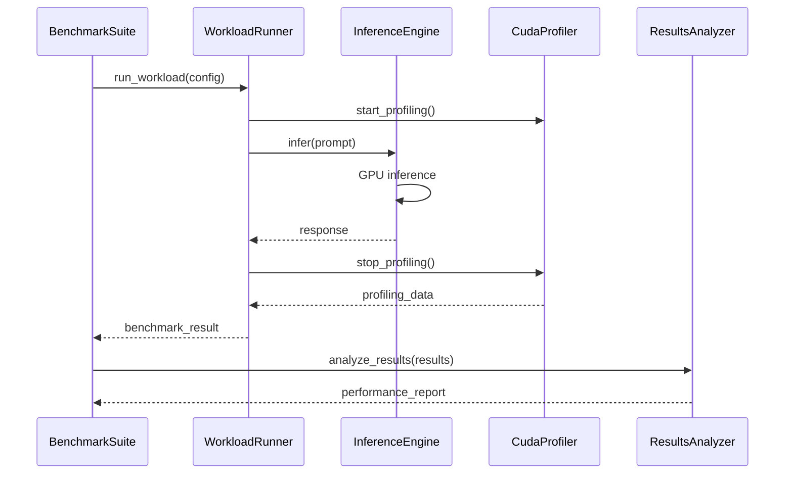

# Mono-Repo Benchmark Architecture

## System Overview

The CUDA Inference Benchmarks is designed as a **mono-repo with isolated binary crates** for each inference engine. This architecture enables:

- **Minimal Dependencies**: Each engine has only its required dependencies
- **Isolated Release Builds**: Build specific engines without pulling unnecessary deps
- **Fair Comparisons**: No shared overhead between engines
- **Independent Testing**: Each engine can be benchmarked in isolation

## Mono-Repo Structure

```
cuda-inference-benchmarks/
├── Cargo.toml              # Workspace root
├── crates/
│   ├── shared-protocol/    # Minimal common types (no heavy deps)
│   ├── benchmark-runner/   # Orchestration and comparison
│   └── engines/
│       ├── pytorch-baseline/    # Python subprocess benchmark  
│       ├── lm-rs-bench/        # lm.rs benchmark binary
│       ├── candle-bench/       # Candle benchmark binary
│       ├── burn-bench/         # Burn benchmark binary
│       └── mistral-rs-bench/   # Mistral.rs benchmark binary
├── models/                 # Shared model files
├── configs/               # Benchmark configurations
└── results/               # Output directory
```

## Engine Isolation Strategy

### 1. Standalone Binary Crates
Each engine is a **separate binary crate** with minimal shared dependencies:

```rust
// crates/engines/candle-bench/Cargo.toml
[package]
name = "candle-bench"
version = "0.1.0"
edition = "2021"

[[bin]]
name = "candle-bench"
path = "src/main.rs"

[dependencies]
# Only Candle-specific dependencies
candle-core = "0.7"
candle-transformers = "0.7"
candle-nn = "0.7"
cudarc = "0.11"

# Minimal shared protocol (no heavy deps)
shared-protocol = { path = "../../shared-protocol" }

# Basic utilities only
serde_json = "1.0"
clap = "4.4"
```

### 2. Minimal Shared Protocol
The `shared-protocol` crate contains **only essential interfaces**:

```rust
// crates/shared-protocol/src/lib.rs
use serde::{Deserialize, Serialize};

#[derive(Debug, Serialize, Deserialize)]
pub struct BenchmarkRequest {
    pub prompt: String,
    pub max_tokens: usize,
    pub temperature: f32,
    pub iterations: usize,
}

#[derive(Debug, Serialize, Deserialize)]
pub struct BenchmarkResponse {
    pub engine_name: String,
    pub generated_text: String,
    pub timings_ms: Vec<f64>,
    pub token_count: usize,
    pub memory_usage_mb: f64,
    pub gpu_utilization: f64,
}

#[derive(Debug, Serialize, Deserialize)]
pub struct EngineCapabilities {
    pub supports_batching: bool,
    pub supports_gpu: bool,
    pub max_sequence_length: usize,
}

// No heavy dependencies, no async traits, no complex infrastructure
```

### 3. Process-Based Communication
Engines run as **independent processes**, communicating via JSON over stdin/stdout:

```rust
// crates/engines/candle-bench/src/main.rs
use shared_protocol::{BenchmarkRequest, BenchmarkResponse};

#[tokio::main]
async fn main() -> Result<()> {
    let request: BenchmarkRequest = serde_json::from_reader(std::io::stdin())?;
    
    // Initialize Candle engine (isolated from other engines)
    let engine = CandleEngine::new(&request.model_path).await?;
    
    // Run benchmark in isolation
    let response = run_isolated_benchmark(&engine, request).await?;
    
    // Return results via stdout
    serde_json::to_writer(std::io::stdout(), &response)?;
    Ok(())
}

async fn run_isolated_benchmark(
    engine: &CandleEngine, 
    request: BenchmarkRequest
) -> Result<BenchmarkResponse> {
    let mut timings = Vec::new();
    
    // Warmup
    for _ in 0..5 {
        engine.infer(&request.prompt).await?;
    }
    
    // Benchmark iterations
    for _ in 0..request.iterations {
        let start = std::time::Instant::now();
        let result = engine.infer(&request.prompt).await?;
        let elapsed = start.elapsed().as_millis() as f64;
        timings.push(elapsed);
    }
    
    Ok(BenchmarkResponse {
        engine_name: "candle".to_string(),
        generated_text: result.text,
        timings_ms: timings,
        token_count: result.tokens.len(),
        memory_usage_mb: get_gpu_memory_usage()?,
        gpu_utilization: get_gpu_utilization()?,
    })
}
```

## Benchmark Runner Orchestration

### 4. Benchmark Runner (`benchmark-runner`)
The orchestrator spawns isolated engine processes:

```rust
// crates/benchmark-runner/src/lib.rs
use shared_protocol::{BenchmarkRequest, BenchmarkResponse};
use std::process::{Command, Stdio};

pub struct BenchmarkRunner {
    engine_binaries: HashMap<String, PathBuf>,
    results_collector: ResultsCollector,
}

impl BenchmarkRunner {
    pub async fn run_comparative_benchmark(&self, config: &BenchmarkConfig) -> Result<ComparisonReport> {
        let mut all_results = HashMap::new();
        
        for engine_name in &config.engines {
            let binary_path = self.engine_binaries.get(engine_name)
                .ok_or_else(|| BenchmarkError::EngineNotFound(engine_name.clone()))?;
            
            let results = self.run_engine_benchmark(binary_path, &config.workload).await?;
            all_results.insert(engine_name.clone(), results);
        }
        
        Ok(self.results_collector.generate_comparison_report(all_results))
    }
    
    async fn run_engine_benchmark(&self, binary_path: &Path, workload: &WorkloadConfig) -> Result<Vec<BenchmarkResponse>> {
        let mut results = Vec::new();
        
        for test_case in &workload.test_cases {
            let request = BenchmarkRequest {
                prompt: test_case.prompt.clone(),
                max_tokens: test_case.max_tokens,
                temperature: test_case.temperature,
                iterations: workload.iterations,
            };
            
            // Spawn isolated engine process
            let mut child = Command::new(binary_path)
                .stdin(Stdio::piped())
                .stdout(Stdio::piped())
                .stderr(Stdio::piped())
                .spawn()?;
            
            // Send request via stdin
            let stdin = child.stdin.take().unwrap();
            serde_json::to_writer(stdin, &request)?;
            
            // Collect response via stdout
            let output = child.wait_with_output().await?;
            if !output.status.success() {
                return Err(BenchmarkError::EngineExecution {
                    engine: binary_path.to_string_lossy().to_string(),
                    stderr: String::from_utf8_lossy(&output.stderr).to_string(),
                });
            }
            
            let response: BenchmarkResponse = serde_json::from_slice(&output.stdout)?;
            results.push(response);
        }
        
        Ok(results)
    }
}
```



## Build and Execution Benefits

### Independent Compilation
```bash
# Build only specific engines for testing
cargo build --release --bin candle-bench
cargo build --release --bin burn-bench

# No need to compile Candle deps when testing Burn
# No shared library version conflicts
# Minimal binary sizes for deployment
```

### Isolated Resource Usage
Each engine process has:
- **Independent Memory**: No shared heap, clean CUDA context
- **Isolated GPU State**: Fresh GPU memory allocations
- **Clean Environment**: No interference from other engines
- **Process Boundaries**: Crashes don't affect other engines

### Fair Performance Comparison
- **No Shared Overhead**: Each engine only pays for its own dependencies
- **Clean Cold Start**: Each process starts fresh for realistic timing
- **No Dynamic Linking Issues**: Static compilation ensures consistency
- **Reproducible Results**: Process isolation eliminates cross-contamination

## Workspace Configuration

### Root Cargo.toml
```toml
[workspace]
members = [
    "crates/shared-protocol",
    "crates/benchmark-runner", 
    "crates/engines/pytorch-baseline",
    "crates/engines/lm-rs-bench",
    "crates/engines/candle-bench",
    "crates/engines/burn-bench",
    "crates/engines/mistral-rs-bench",
]
resolver = "2"

# Shared workspace dependencies (minimal)
[workspace.dependencies]
serde = { version = "1.0", features = ["derive"] }
serde_json = "1.0"
tokio = { version = "1.0", features = ["rt", "process"] }
clap = { version = "4.4", features = ["derive"] }

# Each engine includes only what it needs
# No shared ML framework dependencies
```

### Engine-Specific Dependencies
```toml
# crates/engines/candle-bench/Cargo.toml - ONLY Candle deps
[dependencies]
candle-core = "0.7"
candle-transformers = "0.7"
shared-protocol = { workspace = true }

# crates/engines/burn-bench/Cargo.toml - ONLY Burn deps  
[dependencies]
burn = "0.13"
shared-protocol = { workspace = true }

# crates/engines/lm-rs-bench/Cargo.toml - Zero ML deps
[dependencies] 
shared-protocol = { workspace = true }
# Direct lm.rs integration (minimal)
```

### 2. Execution Pipeline


### 3. Memory Management
```rust
pub struct ResourcePool {
    cuda_events: Vec<CudaEvent>,
    gpu_memory_pool: GpuMemoryPool,
    cpu_buffers: Vec<Vec<u8>>,
}

impl ResourcePool {
    pub fn acquire_cuda_events(&mut self) -> (CudaEvent, CudaEvent) {
        let start = self.cuda_events.pop().unwrap_or_else(|| self.device.create_event().unwrap());
        let end = self.cuda_events.pop().unwrap_or_else(|| self.device.create_event().unwrap());
        (start, end)
    }
    
    pub fn return_cuda_events(&mut self, start: CudaEvent, end: CudaEvent) {
        self.cuda_events.push(start);
        self.cuda_events.push(end);
    }
}
```

## Profiling Architecture

### CUDA Performance Measurement
```rust
pub struct CudaProfiler {
    device: CudaDevice,
    resource_pool: ResourcePool,
    metrics_collector: MetricsCollector,
}

impl CudaProfiler {
    pub async fn profile_inference<F, Fut>(&mut self, 
        engine_name: &str, 
        inference_fn: F
    ) -> Result<ProfilingResult>
    where
        F: FnOnce() -> Fut,
        Fut: std::future::Future<Output = Result<InferenceResponse>>,
    {
        let (start_event, end_event) = self.resource_pool.acquire_cuda_events();
        
        // Start profiling
        start_event.record(&self.device.default_stream())?;
        let memory_before = self.get_gpu_memory_usage()?;
        
        // Execute inference
        let response = inference_fn().await?;
        
        // End profiling  
        end_event.record(&self.device.default_stream())?;
        self.device.synchronize()?;
        let memory_after = self.get_gpu_memory_usage()?;
        
        let elapsed_ms = start_event.elapsed_time(&end_event)?;
        
        // Return resources
        self.resource_pool.return_cuda_events(start_event, end_event);
        
        Ok(ProfilingResult {
            engine_name: engine_name.to_string(),
            elapsed_ms,
            memory_used_mb: memory_after - memory_before,
            gpu_utilization: self.metrics_collector.get_gpu_utilization(),
            response,
        })
    }
}
```

### Statistical Analysis
```rust
pub struct StatisticalAnalyzer {
    confidence_level: f64,
    outlier_threshold: f64,
}

impl StatisticalAnalyzer {
    pub fn analyze_timings(&self, timings: &[f64]) -> TimingStatistics {
        // Remove outliers (top/bottom 5%)
        let mut cleaned = self.remove_outliers(timings);
        cleaned.sort_by(|a, b| a.partial_cmp(b).unwrap());
        
        TimingStatistics {
            mean_ms: statistical_mean(&cleaned),
            median_ms: percentile(&cleaned, 0.5),
            p90_ms: percentile(&cleaned, 0.9),
            p99_ms: percentile(&cleaned, 0.99),
            std_dev_ms: standard_deviation(&cleaned),
            sample_count: cleaned.len(),
        }
    }
    
    pub fn compare_engines(&self, 
        baseline: &BenchmarkResult, 
        optimized: &BenchmarkResult
    ) -> ComparisonResult {
        let speedup = baseline.timing_stats.mean_ms / optimized.timing_stats.mean_ms;
        let significance = self.statistical_significance_test(
            &baseline.raw_timings,
            &optimized.raw_timings,
        );
        
        ComparisonResult {
            speedup_ratio: speedup,
            confidence_interval: significance.confidence_interval,
            p_value: significance.p_value,
            effect_size: significance.effect_size,
        }
    }
}
```

## Extensibility Design

### Adding New Inference Engines
1. **Create Adapter Crate**: Implement `InferenceEngine` trait
2. **Add Configuration**: Update engine registry
3. **Integration Test**: Verify compatibility with benchmark harness

```rust
// New engine integration example
pub fn register_custom_engine() -> Result<()> {
    ENGINE_REGISTRY.register("custom_engine", |config| {
        Box::new(CustomEngine::from_config(config)?)
    })?;
    Ok(())
}
```

### Plugin Architecture
```rust
pub trait BenchmarkPlugin: Send + Sync {
    fn name(&self) -> &str;
    fn pre_benchmark_hook(&self, config: &BenchmarkConfig) -> Result<()>;
    fn post_benchmark_hook(&self, results: &BenchmarkResults) -> Result<()>;
    fn custom_analysis(&self, results: &BenchmarkResults) -> Result<AnalysisReport>;
}

// Example: Cost analysis plugin
pub struct CostAnalysisPlugin {
    gpu_cost_per_hour: f64,
}

impl BenchmarkPlugin for CostAnalysisPlugin {
    fn custom_analysis(&self, results: &BenchmarkResults) -> Result<AnalysisReport> {
        let cost_per_token = self.calculate_cost_efficiency(results);
        Ok(AnalysisReport::cost_analysis(cost_per_token))
    }
}
```

## Error Handling Strategy

### Hierarchical Error Types
```rust
#[derive(Error, Debug)]
pub enum BenchmarkError {
    #[error("Configuration error: {message}")]
    Config { message: String },
    
    #[error("Engine error in {engine}: {source}")]
    Engine { 
        engine: String,
        #[source] 
        source: Box<dyn std::error::Error + Send + Sync> 
    },
    
    #[error("CUDA error: {operation} failed")]
    Cuda { operation: String },
    
    #[error("Statistical analysis error: {message}")]
    Analysis { message: String },
}
```

### Graceful Degradation
```rust
impl BenchmarkSuite {
    pub async fn run_with_fallback(&self) -> BenchmarkResults {
        let mut results = Vec::new();
        
        for engine in &self.engines {
            match self.benchmark_engine(engine).await {
                Ok(result) => results.push(result),
                Err(e) => {
                    warn!("Engine {} failed: {}", engine.name(), e);
                    results.push(BenchmarkResult::failed(engine.name(), e));
                }
            }
        }
        
        BenchmarkResults::new(results)
    }
}
```

## Performance Optimizations

### Parallel Execution
```rust
pub async fn run_concurrent_benchmarks(
    engines: Vec<Arc<dyn InferenceEngine>>,
    workloads: Vec<WorkloadConfig>,
) -> Result<Vec<BenchmarkResult>> {
    let semaphore = Arc::new(Semaphore::new(MAX_CONCURRENT_ENGINES));
    
    let tasks: Vec<_> = engines.into_iter()
        .flat_map(|engine| {
            workloads.iter().map(move |workload| {
                let engine = Arc::clone(&engine);
                let workload = workload.clone();
                let semaphore = Arc::clone(&semaphore);
                
                tokio::spawn(async move {
                    let _permit = semaphore.acquire().await?;
                    benchmark_single_case(engine, workload).await
                })
            })
        })
        .collect();
    
    let results = futures::future::try_join_all(tasks).await?;
    Ok(results)
}
```

### Resource Management
- **Connection Pooling**: Reuse CUDA contexts and GPU memory
- **Lazy Loading**: Load models on first use
- **Memory Monitoring**: Prevent OOM conditions
- **Thermal Management**: Pause benchmarks if GPU overheats

This architecture provides a robust foundation for comprehensive, reproducible, and extensible inference engine benchmarking.